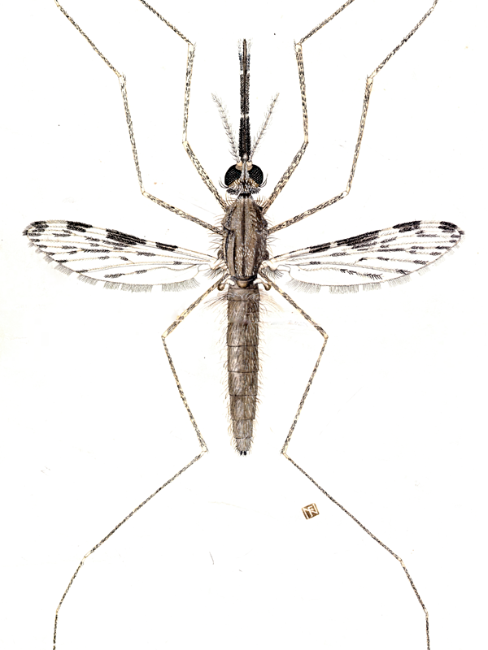

::: {.grid .homepage-grid}

::: {.g-col-12 .g-col-lg-5 .homepage-profile}

::: {.homepage-profile-inner}

{.homepage-mosquito fig-alt="Mosquito illustration"}

# Carlo Costantini, PhD {.homepage-name}

::: {.homepage-links}

[{fig-alt="ORCID"}](https://orcid.org/0000-0003-1016-129X){aria-label="ORCID"}

[{fig-alt="Google Scholar"}](https://scholar.google.com/citations?user=RLWDKbMAAAAJ){aria-label="Google Scholar"}

[{fig-alt="HAL"}](https://hal.science/search/index/?q=*&authIdPerson_i=173799){aria-label="HAL"}

[{fig-alt="GitHub"}](https://github.com/costantinicarlo){aria-label="GitHub"}

[{fig-alt="X"}](https://www.twitter.com/costantini_ird){aria-label="X, formerly Twitter"}

[{fig-alt="Email"}](mailto:carlo.costantini@ird.fr){aria-label="Email"}

:::

:::
:::

::: {.g-col-12 .g-col-lg-7 .homepage-main}

## Nature ⇄ Mosquitoes ⇄ Data ⇄ Models ⇄ Science {.homepage-tagline}

I am a **naturalist and evolutionary ecologist** with a background in **medical entomology** and a lifelong interest in field biology and ornithology.

Mosquitoes are my principal biological system for investigating how organisms interact with, adapt to, and evolve in heterogeneous and changing environments. My research spans adaptation, ecological divergence and speciation, behaviour and host choice, population dynamics, community ecology, and the evolutionary processes underlying vectorial traits.

At the biological core of my work are **the 3Es of mosquitoes: Ecology, Ethology, and Evolution**.

I approach these questions by moving iteratively between field observations, experiments, environmental measurements, omics, quantitative analysis and statistical modelling. Increasingly, this means integrating genomic and phenotypic information with environmental data across scales—from individual mosquitoes to populations, communities and landscapes.

Mosquitoes are especially compelling because their ecology and evolution can directly affect pathogen transmission. Understanding why mosquito populations change their habitats, hosts, behaviour or genomes can therefore illuminate both fundamental evolutionary processes and the epidemiology of diseases such as malaria or dengue.

[**Explore my research themes →**](research/index.qmd)

### About

I studied Natural Sciences at the [University of Rome *La Sapienza*](https://smfn.web.uniroma1.it) before completing a PhD in Biology at [Imperial College of Science, Technology and Medicine](https://www.imperial.ac.uk/life-sciences/), while working as a Research Assistant at its [Silwood Park](https://www.imperial.ac.uk/silwood-park/) field station.

Much of my scientific career has been spent working in sub-Saharan Africa, particularly in Burkina Faso, Cameroon, and Senegal, where I have combined field research with training, supervision and scientific partnerships.

In 2004 I joined the [French Research Institute for Sustainable Development](https://www.ird.fr), and I am currently based at the [Institut Pasteur de Dakar](https://institutpasteurdakar.sn/) in Senegal. Here my work ranges from mosquito evolutionary ecology and genomics to environmental data science, although I can still occasionally be found out in the field, chasing mosquitoes.

[**More about me →**](about.qmd)

:::

:::